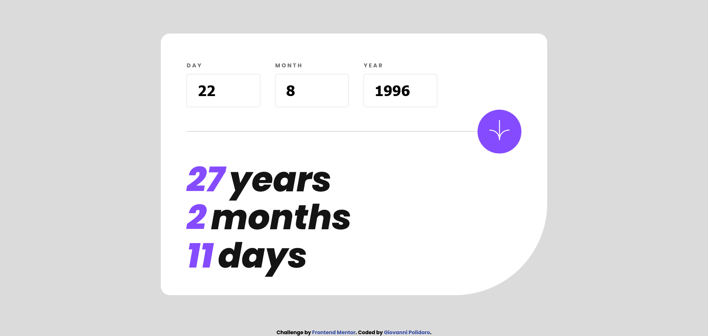
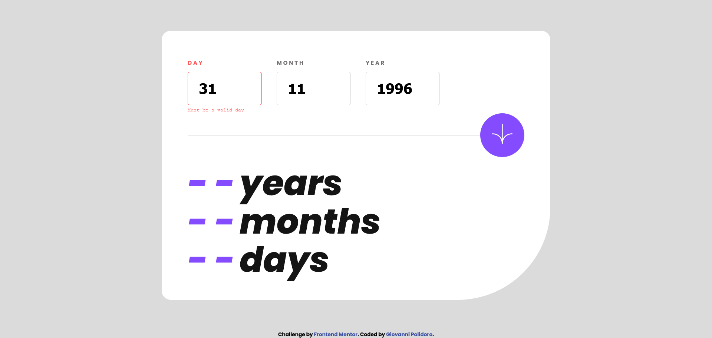
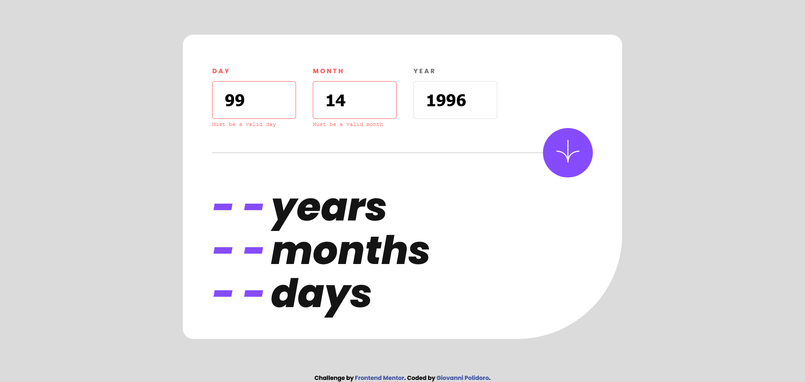
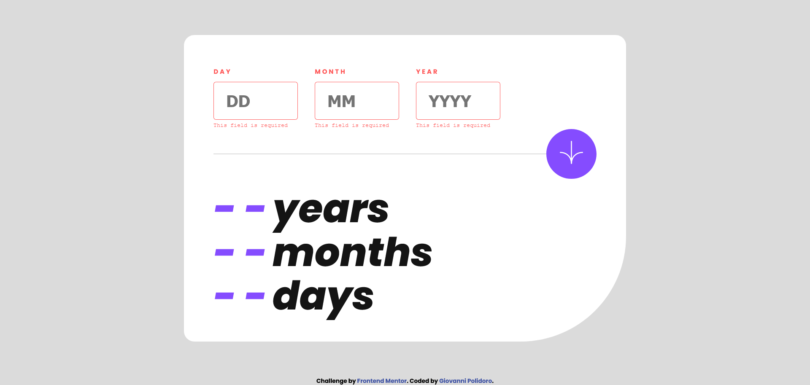
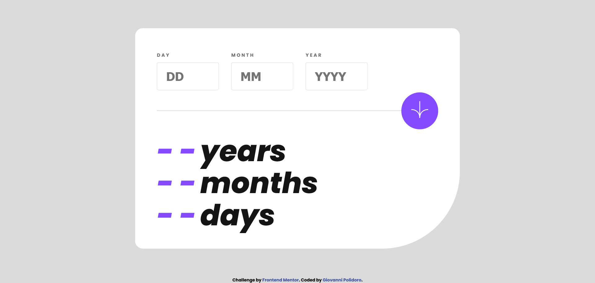

# Frontend Mentor - Age calculator app solution

This is a solution to the [Age calculator app challenge on Frontend Mentor](https://www.frontendmentor.io/challenges/age-calculator-app-dF9DFFpj-Q).

## Table of contents

- [Overview](#overview)
  - [The challenge](#the-challenge)
  - [Screenshot](#screenshot)
  - [Links](#links)
- [My process](#my-process)
  - [Built with](#built-with)
  - [What I learned](#what-i-learned)
- [Author](#author)

## Overview

### The challenge

Gli utenti dovrebbero essere in grado di:

- Visualizza un'età in anni, mesi e giorni dopo aver inviato una data valida tramite il modulo
- Ricevi errori di convalida se:
  - Qualsiasi campo è vuoto quando il modulo viene inviato
  - Il numero del giorno non è compreso tra 1 e 31
  - Il numero del mese non è compreso tra 1 e 12
  - L'anno è nel futuro
  - La data non è valida, ad es. 31/04/1991 (ci sono 30 giorni in aprile)
- Visualizza il layout ottimale per l'interfaccia in base alle dimensioni dello schermo del dispositivo
- Visualizza gli stati al passaggio del mouse e di messa a fuoco per tutti gli elementi interattivi sulla  pagina


### Screenshot








### Links

- Solution URL: [Add solution URL here](https://your-solution-url.com)
- Live Site URL: [Add live site URL here](https://your-live-site-url.com)

## My process

### Built with

- Semantic HTML5 markup
- CSS custom properties
- Flexbox
- Javascript


### What I learned

Per le funzioni di controllo dei dati inseriti nel form ho adottato una solutione che in caso di dato non corretto viene richiamata una fuzoene che aggiunge il messaggio di errore in più le classi di errore corrispondente all'input errato


```js
function monthValidation() {
   if(inputMonth.value > 12){
        addClassError(inputMonth,'Must be a valid month')
        return false
    }
    return true
}
```

```js
function addClassError (input,textError) {
    input.nextElementSibling.textContent=textError;
    input.classList.add('errorInput');
    input.previousElementSibling.classList.add('error');
}
```

## Author

- Website - [Giovanni Polidoro](https://www.giovannipolidoro.eu)
- Frontend Mentor - [@gialloblink](https://www.frontendmentor.io/profile/gialloblink)
- GitHub - [@gialloblink](https://github.com/gialloblink)